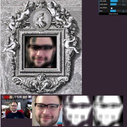

# masque
## Face Isolation using JSFeat

Goal: extract face from webcam video

Process:
* Detect and crop to largest face
* Convert RGB to HSV, keeping the Hue channel to [key](http://dx.doi.org/10.1109/EURCON.2003.1248169) off of [skin tone](https://larryjordan.com/articles/color-correction-make-people-look-normal)
* Morphological operations on the hue key to isolate face and clean up edges.
* Use mask as alpha channel for Canvas image data.

Usage:
* Works best in Firefox or Chrome (https only)
* Grant permission to access your camera
* Adjust the `min_scale` and `scale_factor` as needed to stabilize your face
* Try turning on `use_ellipse` [Firefox 48 known to support this feature]
* Adjust the `blur` of the mask

